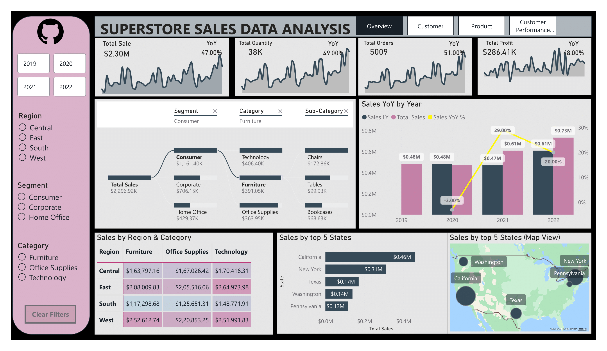
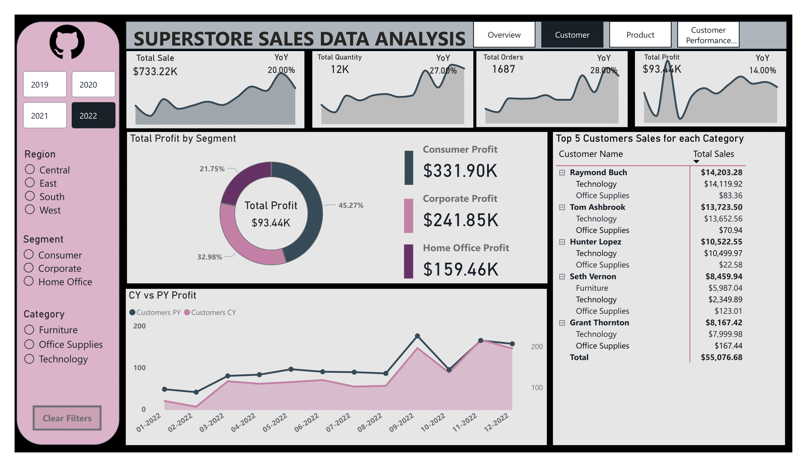
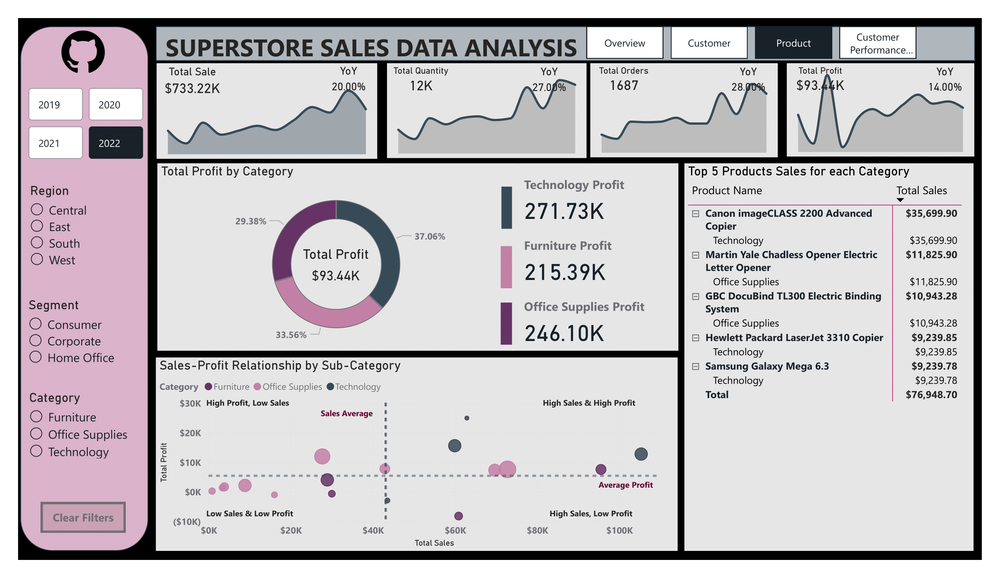
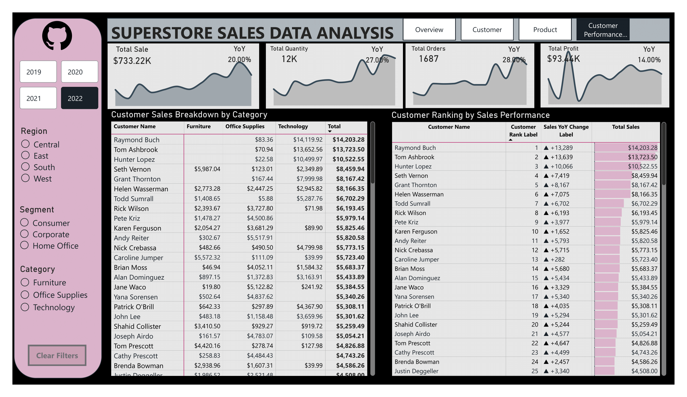

# 📊 Superstore Sales Data Analysis Dashboard (Power BI)

## 🧠 Project Overview
This project presents a **comprehensive Power BI dashboard** built using the *SuperStore Sales* dataset.  
The dashboard provides insights into **sales performance, profitability, customer trends, and product performance** across multiple dimensions such as region, category, and customer segments.

---

## 🗂️ Dataset

**File:** `superstore sales dataset_sanitized.csv`  
**Source:** Fictional Superstore dataset (commonly used for BI and data visualization practice).

### Columns Overview
| Column Name | Description |
|--------------|-------------|
| Order ID | Unique identifier for each order |
| Order Date | Date when the order was placed |
| Ship Date | Date when the order was shipped |
| Ship Mode | Type of shipping (Standard, Second Class, etc.) |
| Customer ID | Unique identifier for each customer |
| Customer Name | Name of the customer |
| Segment | Market segment (Consumer, Corporate, Home Office) |
| Country | Country of sale |
| City | City where the order was shipped |
| State | State within the U.S. |
| Postal Code | ZIP or postal code |
| Region | Geographic region |
| Product ID | Unique identifier for the product |
| Category | Product category (Furniture, Office Supplies, Technology) |
| Sub-Category | Product sub-category |
| Product Name | Full name of the product sold |
| Sales | Total sales value of the transaction |
| Quantity | Quantity of items sold |
| Discount | Discount applied on the sale |
| Profit | Profit made from the transaction |
| **Profit Margin %** | Percentage of profit relative to total sales for each transaction |

---

## 🧮 Key Metrics

| Metric | Description |
|---------|--------------|
| **Total Sales** | $2.3M total sales across all regions |
| **Total Profit** | $286K total profit |
| **Total Orders** | 5,009 orders completed |
| **Total Quantity** | 38K products sold |
| **YoY Growth (Sales)** | 47% |
| **YoY Growth (Profit)** | 48% |

---

## 📈 Dashboard Highlights

### **1️⃣ Overview Page**
- Displays KPIs for Total Sales, Profit, Orders, and Quantity with YoY growth.
- Dynamic date filters and region filters.
- Sales trend from 2019–2022.

### **2️⃣ Regional & Category Analysis**
- Sales and profit breakdown by region and category.
- Regional performance comparison table.
- Top 5 states by sales (map visualization using Azure Maps).

### **3️⃣ Customer Analysis**
- Customer ranking by sales performance.
- YoY customer growth and rank change indicators.
- Top customers contributing to overall sales and profit.

### **4️⃣ Product Analysis**
- Top 5 products by category.
- Sales vs. Profit scatter chart to identify high-profit and high-sales items.
- Sub-category trend comparison over years.

---

## 🧭 Key Insights

| Category | Insight |
|-----------|----------|
| **Regional Performance** | West Region leads with the highest sales and profit contribution (~30%). |
| **Profitability** | Technology products yield the best margins (~37% of total profit). |
| **Customer Segments** | Consumer segment drives over 50% of total revenue. |
| **Sales Trends** | Consistent YoY growth from 2019–2022 in both sales and profit. |
| **Top States** | California, New York, and Texas account for nearly half of total sales. |
| **Discount Impact** | Higher discounts, especially in Furniture, reduce overall profit margins. |
| **Customer Loyalty** | Repeat customers contribute significantly to consistent profit margins. |
| **Product Insights** | Canon imageCLASS Copier and HP LaserJet models are top-performing products. |
| **Category Performance** | Office Supplies shows steady performance with stable profit growth. |
| **Shipping Insights** | Central and East regions exhibit slower delivery patterns impacting sales-to-profit ratios. |
| **Segment Trends** | Home Office sales increased significantly in 2022, suggesting remote-work-related demand. |

---

## 💡 Project Learnings

| Area | Key Learning |
|-------|---------------|
| **Power Query** | Cleaned, transformed, and standardized data using Power Query Editor — handled missing values, changed data types, created new columns, and removed duplicates. |
| **Power BI Modeling** | Built a star schema connecting fact and dimension tables for efficient DAX calculations. |
| **DAX Formulas** | Developed dynamic KPIs and YoY calculations using `CALCULATE()`, `RANKX()`, `FILTER()`, and `SAMEPERIODLASTYEAR()`. |
| **Data Visualization** | Applied conditional formatting, dynamic labels, and consistent color themes for readability. |
| **Pagination** | Implemented DAX-based pagination to view customer rankings in chunks for better usability. |
| **Performance Optimization** | Improved report efficiency by optimizing measures and disabling unnecessary interactions. |
| **Data Storytelling** | Designed dashboards that not only show data but communicate insights clearly to decision-makers. |

---

## 🧰 Tools Used

| Tool | Purpose |
|------|----------|
| **Power BI Desktop** | Data modeling, DAX measures, dashboard design and visualization|
| **Power Query** | Data extraction, transformation, and loading (ETL) |
| **Power BI Modeling** | Designing relationships, star schema, and creating calculated tables |
| **Microsoft Excel** | Initial data cleaning, preprocessing and validation |
| **DAX** | KPI calculation and dynamic measures |
| **Azure Maps** | Interactive regional visualization |

---

## 📸 Dashboard Preview

### Overview

### Customer Ranking

### Product Analysis

### Customer Performance

---

## 💭 Future Improvements

Integrate forecasting visuals to predict next-year sales and profit.
 Add drill-through and tooltip pages for detailed customer-level insights.
 Implement R/Python visuals for advanced predictive analytics.
